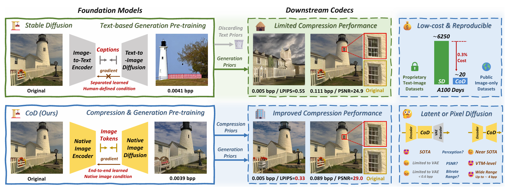
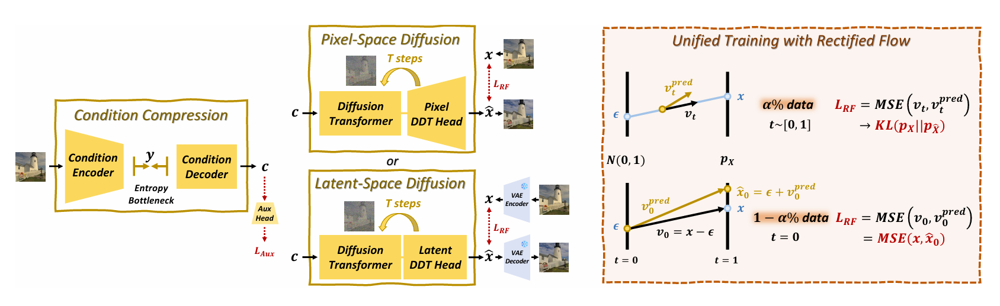
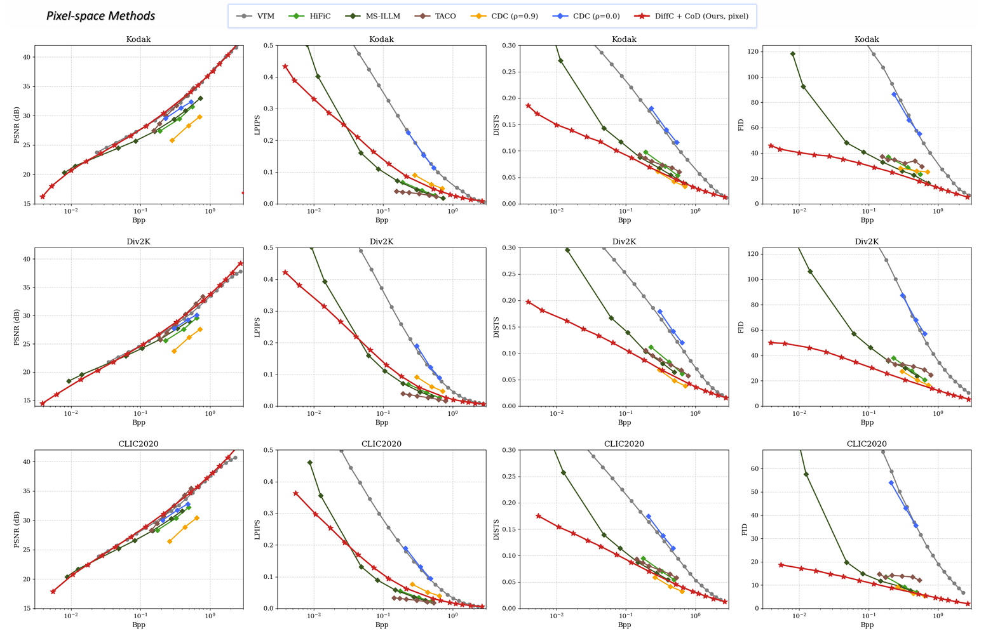
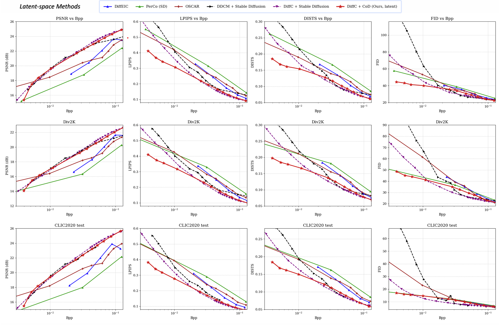
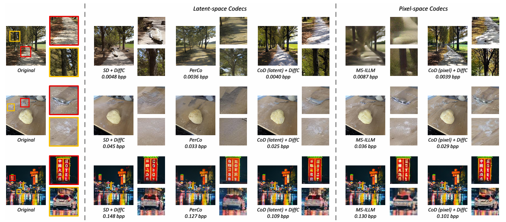
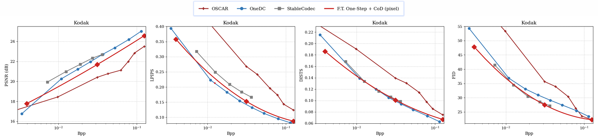
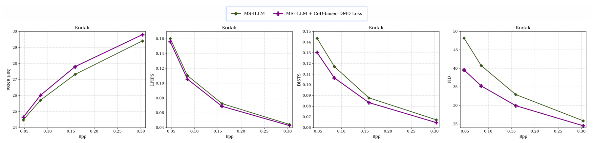
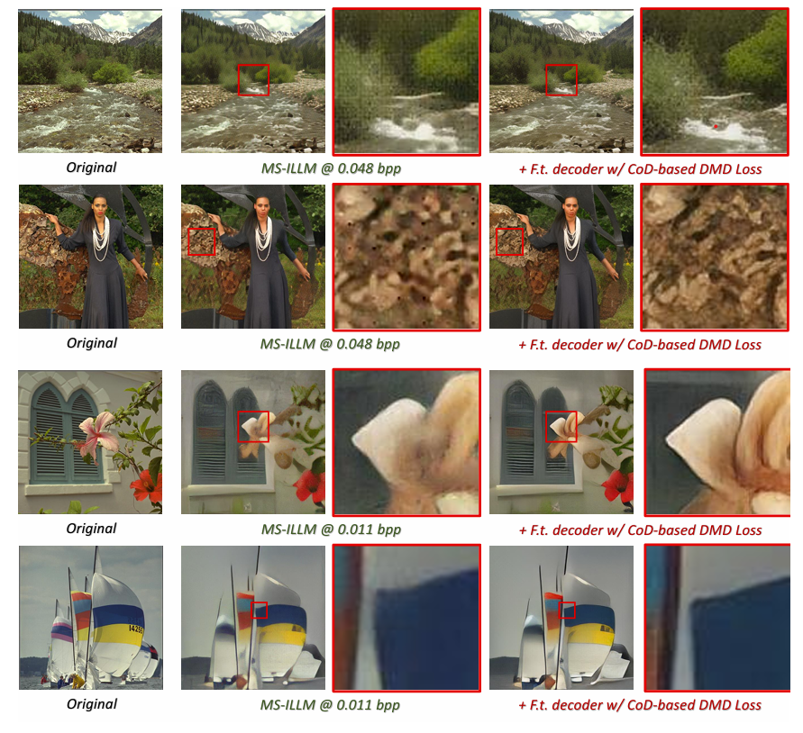

<h2 align="center">CoD: A Diffusion Foundation Model for Image Compression</h2>

<p align="center">
<b>CVPR 2026</b>
</p>

<p align="center">
  <a href="https://arxiv.org/abs/2511.18706"></a>
  <a href="https://huggingface.co/zhaoyangjia/CoD"></a>
</p>

---

<p align="center">
  
</p>

## 📖 Introduction

**CoD** (**Co**mpression-oriented **D**iffusion) is the first diffusion foundation model designed and trained from scratch specifically for image compression. Unlike prior approaches that repurpose pretrained text-to-image models like Stable Diffusion, CoD is trained end-to-end on image-only data with a native encoder–decoder architecture tailored for compression: a condition encoder extracts image-native features, a VQ information bottleneck compresses them into a compact bitstream, and a Diffusion Transformer reconstructs the image conditioned on the quantized representation.

<p align="center">
  
</p>

### ✨ Key Features

🧱 **CoD as a Compression-oriented Foundation Model**
- **Compression-native design** — trained from scratch for compression, not adapted from text-to-image models
- **Training efficiency** — ~300× less training compute than Stable Diffusion (~20 A100 GPU days), using only fully-open image datasets
- **Towards pixel diffusion** — supporting **pixel** diffusion and **latent** diffusion models under one unified architecture
- **Towards extremely-low bitrates** — from 0.0039 bpp to extremely-low 0.00024 bpp (64 bits for 512x512 image) compression

🔌 **CoD for Downstream Applications**
- **Zero-shot variable-rate coding** — continuous rate control via [DiffC](downstream/diffc/README_DiffC.md) without retraining
- **Finetuned one-step coding** — distill into [One-step CoD](downstream/finetuned_one_step_cod.py) via DMD, demonstrating competitive performance with SOTA one-step diffusion codecs.
- **As a perceptual loss** — provide DMD-based perceptual supervision to boost other reconstruction tasks (e.g., improving FID from 92.5 to 80.9 on [MS-ILLM](downstream/perceptual_loss_inference.py)).


## 🏆 Performance

Metrics evaluated on Kodak (512×512):

| Model | BPP | PSNR ↑ | LPIPS ↓ | DISTS ↓ | FID ↓ | Checkpoint | Config |
|:------|:---:|:------:|:-------:|:-------:|:-----:|:----------:|:------:|
| CoD (pixel) | 0.0039 | 16.21 | 0.434 | 0.186 | 46.0 | [Download](https://huggingface.co/zhaoyangjia/CoD/resolve/main/cod/CoD_pixel_vpred.pt) | [Config](https://huggingface.co/zhaoyangjia/CoD/resolve/main/cod/CoD_pixel_vpred.yaml) |
| CoD (latent) | 0.0039 | 15.03 | 0.415 | 0.188 | 45.7 | [Download](https://huggingface.co/zhaoyangjia/CoD/resolve/main/cod/CoD_latent_vpred.pt) | [Config](https://huggingface.co/zhaoyangjia/CoD/resolve/main/cod/CoD_latent_vpred.yaml) |
| CoD (latent) | 0.00024 | 10.09 | 0.686 | 0.288 | 69.5 | [Download](https://huggingface.co/zhaoyangjia/CoD/resolve/main/cod/CoD_latent_vpred_64bits.pt) | [Config](https://huggingface.co/zhaoyangjia/CoD/resolve/main/cod/CoD_latent_vpred_64bits.yaml) |

All checkpoints are available on [HuggingFace](https://huggingface.co/zhaoyangjia/CoD) (including one-step and perceptual loss models).

### Rate-Distortion Curves (DiffC + CoD)

<details>
<summary>Click to expand</summary>

<p align="center">
  
</p>
<p align="center">
  
</p>

</details>

### Visual Comparison (DiffC + CoD)

<p align="center">
  
</p>

## 🔧 Installation

### Setup

```bash
git clone https://github.com/microsoft/GenCodec.git
cd GenCodec/CoD
conda create -n cod python=3.12
conda activate cod
pip install -r requirements.txt

# for training only
bash scripts/setup_train.sh
```

### Download Checkpoints

```bash
# Download base CoD models
huggingface-cli download zhaoyangjia/CoD --include "cod/*" --local-dir ./pretrained/CoD

# Download one-step models
huggingface-cli download zhaoyangjia/CoD --include "finetuned_one_step_cod/*" --local-dir ./pretrained/CoD

# Download perceptual loss models
huggingface-cli download zhaoyangjia/CoD --include "perceptual_loss_illm_dec/*" --local-dir ./pretrained/CoD

# Download everything
huggingface-cli download zhaoyangjia/CoD --local-dir ./pretrained/CoD
```

## 🚀 Inference

The inference CLI has three subcommands: `compress`, `decompress`, and `evaluate`.

### Compress

Encode images into `.cod` bitstreams:

```bash
python -m cod.inference compress \
    --ckpt ./pretrained/CoD/cod/CoD_pixel_vpred.pt \
    --config ./pretrained/CoD/cod/CoD_pixel_vpred.yaml \
    --input <image_dir> \
    --output <bitstream_dir>
```

### Decompress

Decode `.cod` bitstreams back to images:

```bash
python -m cod.inference decompress \
    --ckpt ./pretrained/CoD/cod/CoD_pixel_vpred.pt \
    --config ./pretrained/CoD/cod/CoD_pixel_vpred.yaml \
    --input <bitstream_dir> \
    --output <recon_dir> \
    --step 25 --cfg 3.0 --sampler adam2
```

### End-to-End Evaluate

Compress and decompress in a single pass:

```bash
python -m cod.inference evaluate \
    --ckpt ./pretrained/CoD/cod/CoD_pixel_vpred.pt \
    --config ./pretrained/CoD/cod/CoD_pixel_vpred.yaml \
    --input <image_dir> \
    --output <recon_dir> \
    --step 25 --cfg 3.0 --sampler adam2
```

> **Note:** CoD (latent) uses `--cfg 1.25`. CoD (pixel) and CoD (latent, 64-bit) use `--cfg 3.0`.


### Arguments

| Argument | Type | Default | Description |
|:---------|:----:|:-------:|:------------|
| `mode` | str | — | `compress`, `decompress`, or `evaluate` |
| `--ckpt` | str | — | Path to model checkpoint |
| `--config` | str | — | Path to YAML config file |
| `--input` | str | — | Input directory (images or `.cod` files) |
| `--output` | str | — | Output directory |
| `--seed` | int | `0` | Random seed |
| `--step` | int | `25` | Diffusion sampling steps |
| `--cfg` | float | `3.0` | Classifier-free guidance scale (`3.0` for pixel / latent-64bits, `1.25` for latent) |
| `--sampler` | str | `adam2` | Sampler type (`adam2` or `euler`) |

## 🏋️ Training

### Data Preparation

We train on open image datasets including [OpenImages](https://storage.googleapis.com/openimages/web/index.html), [SAM-1B](https://ai.meta.com/datasets/segment-anything/), and [ImageNet-21K](https://www.image-net.org/). See [`scripts/prepare_datasets/README.md`](scripts/prepare_datasets/README.md) for the full data preparation pipeline.


### Training

The full pipeline has three stages with automatic checkpoint chaining:

```bash
python entry_train_cod.py \
    --data_dir <data_dir> \
    --save_dir <save_dir> \
    --exp_name my_experiment \
    --bpp 0_0039
```

Add `--latent` for latent-space mode. DINOv2 weights default to the path installed by `scripts/setup_train.sh`.

| Stage | Resolution | Batch Size | Max Steps | Description |
|:-----:|:---------:|:----------:|:---------:|:------------|
| 1 | 256×256 | 128 | 400K | Low-resolution pre-train |
| 2 | 512×512 | 64 | 100K | High-resolution fine-tune|
| 3 | 512×512 | 64 | 50K | Unified post-training |

> The launcher auto-detects GPUs and adjusts per-GPU batch size with gradient accumulation.


## 📊 Evaluation

Compute image quality metrics between reference and reconstructed images:

```bash
python scripts/metric.py \
    --ref <reference_dir> \
    --recon <reconstruction_dir> \
    --device cuda:0 \
    --fid_patch_size 64 \
    --output_path <output_dir> \
    --output_name my_experiment
```

**Supported metrics:** PSNR, LPIPS (AlexNet), DISTS, FID.

> FID uses patch-based computation ([Mentzer et al., 2020](https://arxiv.org/abs/2006.09965)) for stable evaluation on small high-resolution datasets.

## 🔀 Downstream Applications

As a compression foundation model, CoD naturally supports various downstream coding algorithms.

### 1. Zero-Shot Variable-Rate Coding (DiffC)

<details>
<summary><b>Click to Expand</b></summary>

**DiffC** treats the reverse diffusion process as a communication channel. By controlling the encoding depth, DiffC enables continuous rate adjustment from ultra-low to high bitrates — without retraining the base model. See [`downstream/diffc/README_DiffC.md`](downstream/diffc/README_DiffC.md) for details.

</details>

### 2. Finetuned One-Step Coding

<details>
<summary><b>Click to Expand</b></summary>

CoD can be distilled into a real-time one-step generator via Distribution Matching Distillation (DMD).

Rate-Distortion Curves

<p align="center">
  
</p>


**Available models:** `bpp_0_0039_noise_1` (non-deterministic decoding), `bpp_0_0039`, `bpp_0_0312`, `bpp_0_1250` (deterministic decoding)

```bash
# Download one-step models
huggingface-cli download zhaoyangjia/CoD --include "finetuned_one_step_cod/*" --local-dir ./pretrained/CoD
```

```bash
# Evaluate (compress + decompress in one pass)
python -m downstream.finetuned_one_step_cod evaluate \
    --ckpt ./pretrained/CoD/finetuned_one_step_cod/bpp_0_0039.pt \
    --config ./pretrained/CoD/finetuned_one_step_cod/bpp_0_0039.yaml \
    --input <image_dir> --output <recon_dir>

# Compress only
python -m downstream.finetuned_one_step_cod compress \
    --ckpt ./pretrained/CoD/finetuned_one_step_cod/bpp_0_0039.pt \
    --config ./pretrained/CoD/finetuned_one_step_cod/bpp_0_0039.yaml \
    --input <image_dir> --output <bitstream_dir>

# Decompress only
python -m downstream.finetuned_one_step_cod decompress \
    --ckpt ./pretrained/CoD/finetuned_one_step_cod/bpp_0_0039.pt \
    --config ./pretrained/CoD/finetuned_one_step_cod/bpp_0_0039.yaml \
    --input <bitstream_dir> --output <recon_dir>
```

</details>

### 3. CoD as a Perceptual Loss

<details>
<summary><b>Click to Expand</b></summary>

CoD provides DMD-based perceptual supervision that can boost other reconstruction tasks. For example, finetuning MS-ILLM's decoder with CoD-based DMD loss at 0.011 bpp:

| Method | PSNR ↑ | LPIPS ↓ | DISTS ↓ | FID ↓ |
|:-------|:------:|:-------:|:-------:|:-----:|
| MS-ILLM | 21.43 | 0.403 | 0.271 | 92.5 |
| + CoD DMD loss | 21.08 | 0.376 | 0.248 | 80.9 |

And more rate-distortion curves:

<p align="center">
  
</p>

Visual comparison: 
<p align="center">
  
</p>

**Available checkpoints:** `msillm_quality_1`, `msillm_quality_2`, `msillm_quality_3`, `msillm_quality_4`, `msillm_quality_vlo2`

Requires [NeuralCompression](https://github.com/facebookresearch/NeuralCompression) (installed automatically via `torch.hub`).

```bash
# Download perceptual loss models
huggingface-cli download zhaoyangjia/CoD --include "perceptual_loss_illm_dec/*" --local-dir ./pretrained/CoD
```

```bash
python -m downstream.perceptual_loss_inference \
    --ckpt ./pretrained/CoD/perceptual_loss_illm_dec/msillm_quality_1.pt \
    --quality 1 \
    --input <image_dir> --output <recon_dir>
```

</details>

## 📝 Citation

If you find this work useful, please consider citing:

```bibtex
@inproceedings{jia2025cod,
    title     = {CoD: A Diffusion Foundation Model for Image Compression},
    author    = {Jia, Zhaoyang and Zheng, Zihan and Xue, Naifu and Li, Jiahao and Li, Bin and Guo, Zongyu and Zhang, Xiaoyi and Li, Houqiang and Lu, Yan},
    booktitle = {Proceedings of the IEEE/CVF Conference on Computer Vision and Pattern Recognition (CVPR)},
    year      = {2026}
}
```

## 🙏 Acknowledgements

This project builds on the following excellent open-source works:

- [PixNerD](https://github.com/MCG-NJU/PixNerd) and [DDT](https://github.com/MCG-NJU/DDT) — The code implementation of diffusion models.
- [DiffC](https://github.com/JeremyIV/diffc) — The code implementation of diffusion-based zero-shot variable-rate coding.
- [NeuralCompression](https://github.com/facebookresearch/NeuralCompression) — MS-ILLM codec for perceptual loss experiments
- [Stable Diffusion VAE](https://huggingface.co/stabilityai/sd-vae-ft-ema) — Latent-space encoder/decoder