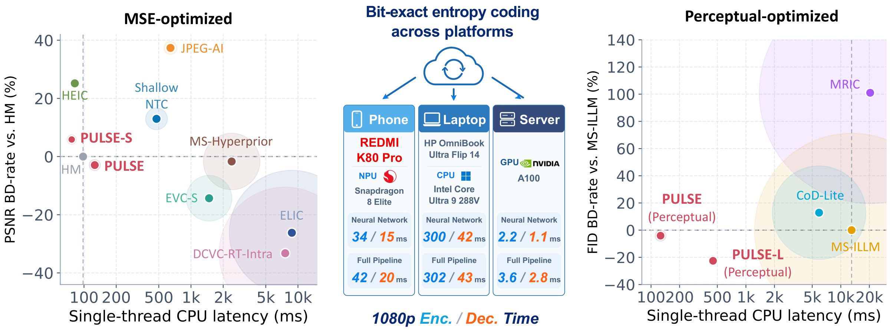
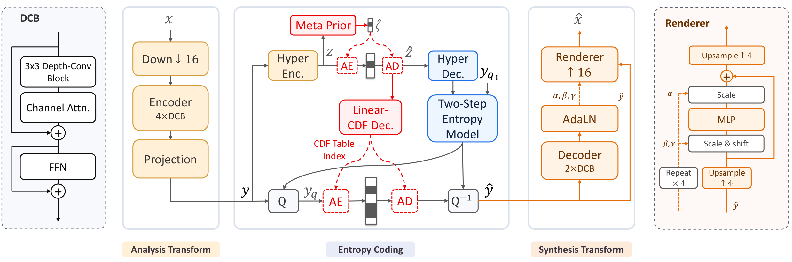

<h2 align="center">PULSE: Unlocking Practical Image Compression on Single-Thread CPU</h2>

<p align="center">
  
  <a href="https://github.com/microsoft/GenCodec/tree/main/PULSE"></a>
  <a href="https://huggingface.co/zhaoyangjia/PULSE"></a>
</p>

---

## 📖 Introduction

**PULSE** is an asymmetric, variable-rate neural image codec that combines
**ultra-low-complexity decoding**, **bit-exact entropy coding**, and
**MSE or perceptual optimization** for practical compression on
resource-constrained hardware.

[Training](docs/training.md) |
[Deployment](docs/deployment.md)



## ✨ Highlight

PULSE pairs low-resolution feature processing with an **AdaLN-modulated pixel
renderer** and a **two-step entropy model**. A content-adaptive **Meta Prior**
compensates for the reduced capacity of the linear CDF decoder, especially in
low-content-complexity regions. It features:

- ⚡ **Single-thread CPU decoding** — The base receiver requires just
  **5.2 kMAC/pixel**. The paper reports **126 ms** decoding for a **1080p** image
  on one AMD EPYC 9V84 CPU thread.
- 🌐 **Cross-platform entropy coding** — **Integer Linear CDF prediction + CPU
  rANS** keep entropy coding bit-exact while neural transforms can run on
  accelerators; floating-point reconstructed pixels need not be bit-identical.
- 🎨 **Flexible rate and quality** — **Eight quality levels per model**, with
  MSE models for S/base and perceptual models for base/L, including
  face/text-aware fine-tuning.
- 🗜️ **Train, compress, and deploy.** This release includes training, Meta Prior
post-training, integer Linear CDF export, y CDF calibration, and independent `.pulse` compression
and decompression. Optimized AMD CPU and H100 benchmarks include entropy coding;
the mobile path provides whole-image QNN/ARM compression and decompression.

<p align="center">
  
</p>

## 🧩 Models

Each model supports eight QPs (`0`–`7`), from lower to higher rate/quality.

| Model | Receiver complexity | Weights | Training config |
|---|---:|---|---|
| PULSE-S (MSE) | ~2.7 kMAC/pixel | `pulse-s-mse` | [Config](configs/mse/s.yaml) |
| PULSE (MSE) | ~5.2 kMAC/pixel | `pulse-mse` | [Config](configs/mse/base.yaml) |
| PULSE (Perceptual) | ~5.2 kMAC/pixel | `pulse-perceptual` | [Config](configs/perceptual/base.yaml) |
| PULSE-L (Perceptual) | ~20 kMAC/pixel | `pulse-l-perceptual` | [Config](configs/perceptual/l.yaml) |

Pretrained bundles and training recipes are provided for these four models.

## 🛠️ Installation

Use Python 3.12 and a C++17 compiler for the pinned environment below.
Install PyTorch 2.5.0 / torchvision 0.20.0 wheels appropriate for your CPU/CUDA
environment, then install PULSE:

```bash
git clone https://github.com/microsoft/GenCodec.git
cd GenCodec/PULSE
pip install -r requirements.txt
pip install -e .
```

This builds the CPU rANS and integer-CDF extension; a CUDA compiler is not
required. Tested with Python 3.12, PyTorch 2.5.0 and torchvision 0.20.0 on Linux.
`requirements.txt` pins the direct dependencies for training, evaluation,
inference and model downloads. Optional ONNX/OpenVINO dependencies are in
`requirements-deploy.txt`. These files are not transitive lockfiles.
For a minimal inference-only installation on Python 3.10+, use
`pip install -e ".[download]"` instead.
ONNX export explicitly uses the TorchScript exporter rather than relying on
version-dependent defaults.

Non-editable installs also include recipes and `pulse-compress`,
`pulse-decompress`, `pulse-train-mse`, `pulse-train-perceptual` and the other
`pulse-*` command-line entry points.

## 📥 Download checkpoints

```bash
python download_models.py --models pulse-mse pulse-perceptual
```

Bundles contain `config.json`, `model.pt`, and `entropy_control_int.pt`.
Keep these files together. Downloads are checked against SHA256 hashes.
Use `--revision <commit>` to pin a Hugging Face model revision.

## 🗜️ Compress and decompress

```bash
python compress.py --model checkpoints/pulse-mse \
  --input image.png --output outputs/image.pulse --qp 3 --device cpu --threads 1

python decompress.py --model checkpoints/pulse-mse \
  --input outputs/image.pulse --output outputs/reconstruction.png --device cpu --threads 1
```

Both commands also accept input/output directories. Decompression does not
require the original image. Use the **same model bundle** for both operations;
`.pulse` files do not embed the neural network. `--device cuda:0` enables CUDA.

New files include a 32-byte envelope with a model identifier, payload length
and checksum. H100 and mobile streams record three lane counts and the skip
partitioning profile for independent entropy sections. See the
[deployment guide](docs/deployment.md) for decoder compatibility and builds.
Wrong bundles and damaged files are rejected before entropy
decoding. Unchecked native files require explicit `--allow-legacy` on decompression;
`compress.py --legacy` writes that unchecked format for compatibility only.

The integer entropy-control path is deterministic across supported devices.
Floating-point reconstructed pixels are not promised to be bit-identical.

Encoding defaults are calibrated part-specific y CDFs, skip-index cutoff **2**,
and **Meta Prior Index Merge** on every platform. Older bundles without a
calibrated y table (including the initial S bundle) must first be updated with
`python -m codec.training.y_cdf`; Gaussian coding is not silently substituted.
Index Merge uses fitted probabilities when present, otherwise its deterministic
P=0.5 initialization. Decoders follow the file header for legacy syntax.

## 📊 Evaluate and benchmark

Build the optimized platform extensions using the guides below before benchmarking.

```bash
python evaluate.py --model checkpoints/pulse-mse --input data/kodak \
  --qps 0 1 2 3 4 5 6 7 --device cuda:0 --output outputs/kodak.json

python -m deployment.cpu_amd_epyc_9v84_single_thread.benchmark --model checkpoints/pulse-mse \
  --height 1088 --width 1920 --output outputs/cpu_amd_epyc_9v84_single_thread.json

python -m deployment.gpu_nvidia_h100.benchmark --model checkpoints/pulse-mse \
  --device cuda:0 --height 1088 --width 1920 --output outputs/gpu_nvidia_h100.json
```

Rates include actual file headers. Timings exclude disk IO, model loading,
graph conversion and warmup. Benchmark results depend on hardware, image content
and runtime versions.
Platform guides: [AMD CPU](deployment/cpu_amd_epyc_9v84_single_thread/README.md),
[H100 GPU](deployment/gpu_nvidia_h100/README.md), and
[REDMI NPU](deployment/npu_qualcomm_snapdragon_8_elite/README.md).
See [Deployment](docs/deployment.md) for the shared timing scope.

Perceptual metric dependencies are included in `requirements.txt`; add
`--perceptual-metrics --dists --fid` to `evaluate.py`.
FID uses 256-pixel patches by default (`--fid-patch 64` selects 64-pixel patches).
Use `evaluate.py --legacy` only when evaluating the native header-rate
convention; the default includes the additional 32-byte integrity envelope.

## 🚀 Training

```bash
python train_mse.py --size base --train-data data/train.txt \
  --hr-data data/train_hr.txt --output runs/pulse-mse

python postprocess.py --model runs/pulse-mse/model --data data/train_hr.txt \
  --output checkpoints/my-pulse-mse
```

MSE supports `--size s` or `base`; perceptual supports `--size base` or `l`.
The perceptual/ROI recipe, teacher preparation,
multi-GPU training and resume commands are in [Training](docs/training.md).
`postprocess.py` also fits the part-specific y CDFs for all four models
and enables Index Merge fitting by default. It creates a new, validated checkpoint at
`--output`, including all three matching model files and `SHA256SUMS`;
the training checkpoint is not overwritten.

## 🙏 Acknowledgments and license

The codec and entropy kernels build on [DCVC](https://github.com/microsoft/DCVC).
We also thank the authors of LPIPS, DINOv2, FaceNet and CRNN.
See [LICENSE](LICENSE); original Microsoft copyright and MIT license notices are retained.
External dependencies and resources remain under their respective licenses.
Third-party teacher weights and vendor SDK/runtime binaries are not included.
