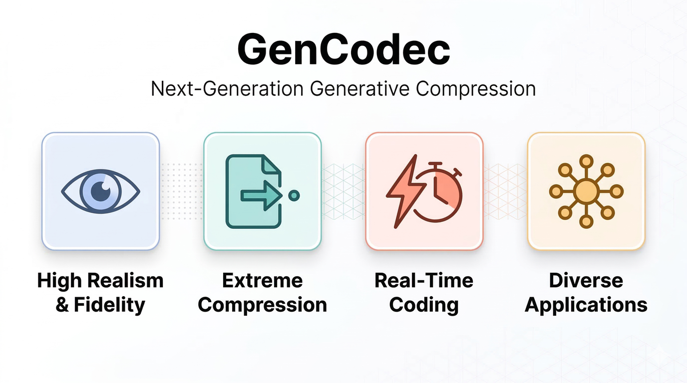

# GenCodec

[](LICENSE)

<p align="center">
  
</p>

## About

**GenCodec** is a research initiative from Microsoft Research Asia pushing the boundaries of generative models for image and video compression. We aim to build the next generation of codecs that go beyond traditional rate-distortion trade-offs, targeting:

- **High Realism & Fidelity** — Visually natural reconstructions with faithful preservation of structural detail and semantic content.
- **Extreme Compression** — Meaningful reconstruction at ultra-low bitrates where conventional codecs produce unusable artifacts.
- **Practical Real-Time Coding** — Efficient encoding and decoding suitable for real-time and on-device deployment.
- **Diverse Applications** — General-purpose compression foundations that extend to more vision tasks and applications.

This repository hosts models, code, and evaluation tools for our published generative compression methods.

## Projects

- [`CoD`](CoD) — **CoD: A Diffusion Foundation Model for Image Compression** (CVPR 2026) [[arXiv]](https://arxiv.org/abs/2511.18706) [[Models]](https://huggingface.co/zhaoyangjia/CoD)
  - Compression-native diffusion model trained from scratch for image compression
  - Supports both pixel-space and latent-space diffusion under a unified architecture
  - Downstream applications: zero-shot variable-rate coding (DiffC), one-step coding, perceptual loss

## License

GenCodec is MIT licensed, as found in the [LICENSE](LICENSE) file.

## Citation

If you find this work useful, please cite the relevant project:

```bibtex
@inproceedings{jia2025cod,
    title     = {CoD: A Diffusion Foundation Model for Image Compression},
    author    = {Jia, Zhaoyang and Zheng, Zihan and Xue, Naifu and Li, Jiahao and Li, Bin and Guo, Zongyu and Zhang, Xiaoyi and Li, Houqiang and Lu, Yan},
    booktitle = {Proceedings of the IEEE/CVF Conference on Computer Vision and Pattern Recognition (CVPR)},
    year      = {2026}
}
```
